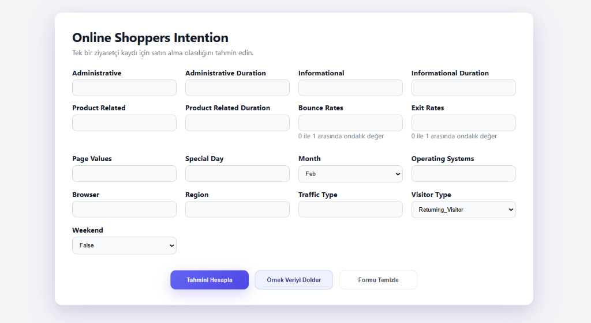

# Online Shoppers Intention – Satın Alma Tahmini

Kaggle’daki Online Shoppers Purchasing Intention verisiyle tek ziyaret oturumunun satın alma ile sonuçlanıp sonuçlanmayacağını (`Revenue`) tahmin eden uçtan uca ML projesi. Veri keşfi, baseline, feature engineering, model optimizasyonu, FastAPI servisi ve basit bir web arayüzü içerir.

1) **Problem:** E-ticaret oturumundan satın alma olasılığını tahmin etmek (pozitif sınıf ~%15,5).  
2) **Baseline:** LogReg (class_weight=balanced) – Acc 0.8500, ROC-AUC 0.8963, Recall (Rev=1) 0.75, F1 0.61.  
3) **FE deneyleri:** Toplam süre, sayfa değeri yoğunluğu, sezon ve geri dönen ziyaretçi bayrakları eklendi; AUC/Recall/F1 yükseldi.  
4) **Validasyon şeması:** Stratified 80/20 train/test; tuning’de 3-fold stratified CV.  
5) **Final pipeline:** 17 orijinal + 4 türetilmiş özellik; sayısal → StandardScaler, kategorik (`Month`, `VisitorType`, `Weekend`) → OneHotEncoder(ignore); model: tuned RandomForest.  
6) **Final vs baseline:** RF (tuned, Acc 0.8694, ROC-AUC 0.9296, Recall 0.7723, F1 0.6469) → AUC +0.03, F1 +0.04.  
7) **İş uyumu:** Pozitif sınıfı kaçırmamak (Recall öncelikli) ve makul precision; özellikler iş tarafından anlaşılır (süre, değer, sezon, ziyaretçi tipi).  
8) **Canlı & izleme:** FastAPI/Render; izlenecekler: Recall/Precision/F1 (Rev=1), PR-AUC, sınıf dağılımı, feature drift (PageValues, ExitRates, Month_*), latency; gerekirse eşik ayarı.

## Demo / Inference
- Canlı: https://ml-bootcamp-final-projesi.onrender.com  
- Lokal UI: `uvicorn src.app:app --reload` → http://127.0.0.1:8000  
- JSON endpoint: `POST http://127.0.0.1:8000/predict.json`

## Ekran / UI
- Canlı web arayüzü: https://ml-bootcamp-final-projesi.onrender.com (form + sonuç kutusu).
- Lokal: `uvicorn src.app:app --reload` → http://127.0.0.1:8000 (şablon `src/templates/index.html`). 



## Proje Özeti (Veri / Pipeline / Metrik)
- **Veri:** 12.330 satır, 17 özellik + hedef; pozitif sınıf 1.908 (~%15,5). Kaynak: [Online Shoppers Purchasing Intention (Kaggle)](https://www.kaggle.com/datasets/imakash3011/online-shoppers-purchasing-intention-dataset).  
- **Baseline:** LogReg (cw=balanced) – Acc 0.8500, ROC-AUC 0.8963, Recall 0.75, F1 0.61.  
- **FE:** `Total_Duration`, `PageValue_per_Product`, `Is_HighSeason`, `Is_ReturningVisitor`; one-hot sonrası ~30+ sütun.  
- **Final Model (aktif):** RandomForest (tuned) – Acc 0.8694, ROC-AUC 0.9296, Precision 0.5566, Recall 0.7723, F1 0.6469.  
- **Alternatif:** LightGBM (tuned) – Acc 0.8812, ROC-AUC 0.9275, Precision 0.5903, Recall 0.7618, F1 0.6651.  
- **Validasyon:** Stratified 80/20 test; tuning’de 3-fold CV.  
- **Artefakt:** `models/final_rf_pipeline.pkl` mevcut.

## Kullanılan Teknolojiler
Python 3.12, pandas, numpy, scikit-learn, lightgbm, fastapi, uvicorn, jinja2, matplotlib/seaborn, pytest.

## Lokal Kurulum
```bash
git clone https://github.com/Ast1va/ML-Bootcamp-Final-Projesi.git
cd online-shoppers-ml-project
python -m venv .venv
# Windows
.venv\Scripts\activate
# macOS / Linux
source .venv/bin/activate
pip install -r requirements.txt
uvicorn src.app:app --reload
# Aç: http://127.0.0.1:8000
```

## Repo Yapısı (Özet)
```
online-shoppers-ml-project/
├── data/
├── docs/
│   ├── 00_setup.md
│   ├── 01_data_overview.md
│   ├── 02_baseline.md
│   ├── 03_feature_engineering.md
│   ├── 04_model_optimization.md
│   ├── 05_evaluation.md
│   ├── 06_final_pipeline.md
│   └── api_deployment.md
├── models/
│   └── final_rf_pipeline.pkl
├── notebooks/
│   └── modeling/
│       ├── 00_EDA.ipynb
│       ├── 01_Baseline.ipynb
│       ├── 02_Feature_Engineering.ipynb
│       ├── 03_Model_Optimization.ipynb
│       ├── 04_Evaluation.ipynb
│       └── 05_Final_Pipeline.ipynb
├── src/
│   ├── templates/
│   │   └── index.html
│   ├── app.py
│   ├── config.py
│   ├── inference.py
│   └── pipeline.py
├── requirements.txt
└── README.md
```

## Lisans
MIT Lisansı. Ayrıntılar için `LICENSE` dosyasına bakın.

## İletişim

📧 **E-posta:** [yagiz.uzunalioglu@gmail.com](mailto:yagiz.uzunalioglu@gmail.com)  
🔗 **GitHub:** [@Ast1va](https://github.com/Ast1va)
